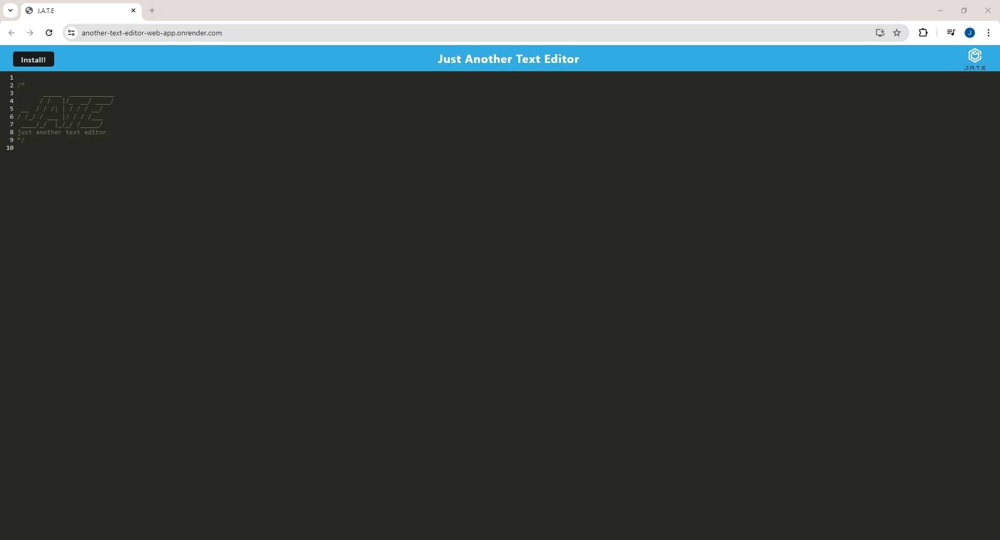

## PWA-Text-editor

#### Table of contents

[Description](#description) 
[Usage](#usage) 
[Features](#features) 
[Screenshot](#screenshot) 
[Contribution](#contribution) 
[Technologies Used](#technologies-used) 
[Links](#links) 
[Licence](#licence) 

### Description

The 19th week of coding bootcamp had us learning about progressive web applications and how they can be used to create apps that are platform independant and work offline. 
The aim of this project was to add to some pre-existing code, changes that enabled a user to install and use offline an already mostly functioning application.  
We had to implement the methods for storing data in an IndexedDB database, register a service worker to help cache data, configure webpack plugins, and so on. 

#### Usage

The application is very easy to use, all that is required is to visit the [application](https://another-text-editor-web-app.onrender.com) in your browser and go from there.  
If the end user so wished, they can install the editor to use offline also.

#### Features

The application has the ability to store persistent data, enabling a user to create any kind of code snippet or notes they so desire, put down their work, and then come back later to finish off what they were doing.  
This functionality is provided using indexedDB, an npm package used for advenced client side storage.

###### Screenshot
**A view of the application in the browser**

#### Contribution

If you are seeking to make changes to the code or just want to test the application on your local machine, you can first:

- [clone the repository](https://github.com/JLP-55/Another-text-editor-web-app)
- `cd` into the repository from the command line
- run `npm install` to install dependencies
- run the command `npm run start:dev` for development mode or... 
- `npm run start` to run the application in production mode

#### Technologies used

This application uses quite a few node.js packages. Some of which include: 

- [babel](https://www.npmjs.com/package/Babel)
- [express](https://www.npmjs.com/package/express)
- [idb](https://www.npmjs.com/package/idb)
- [if-env](https://www.npmjs.com/package/if-env)
- [nodemon](https://www.npmjs.com/package/nodemon)
- [concurrently](https://www.npmjs.com/package/concurrently)
- [webpack](https://www.npmjs.com/package/webpack)
- [workbox-webpack-plugin](https://www.npmjs.com/package/workbox-webpack-plugin)

To see all packages, just visit the package.json files inside the root, server and client directiories respectively

#### Links

[Link](https://github.com/JLP-55/Another-text-editor-web-app) to the github repository 
[Link](https://another-text-editor-web-app.onrender.com) to the deployed application 

#### Licence

MIT Lincense